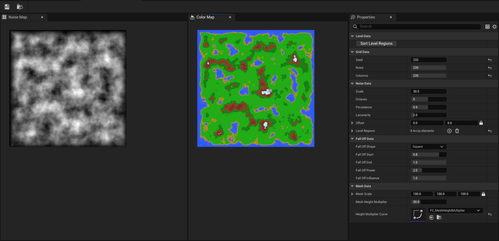
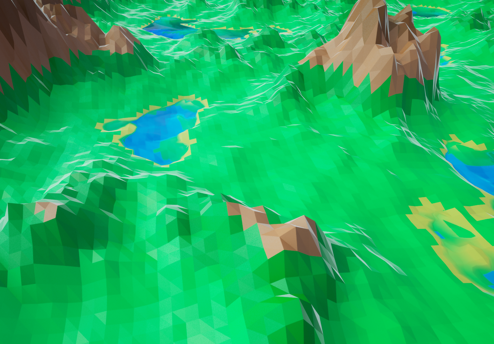
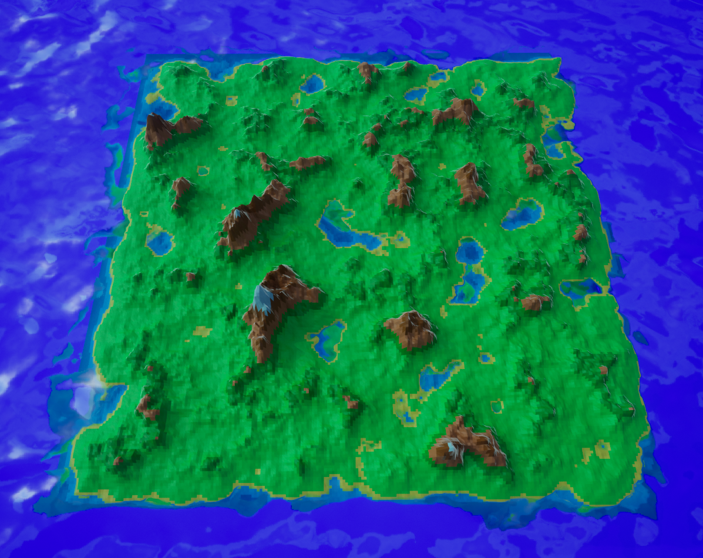

# ProceduralLevelGenerator

The `ProceduralLevelGenerator` project is a robust and innovative custom plugin for the Unreal Engine, developed using both C++ and Blueprints for comprehensive compatibility and usability. It harnesses the power of procedural generation techniques to create diverse and engaging 3D levels for games and simulations.

The plugin utilizes Perlin Noise, a popular gradient noise algorithm, to generate coherent and visually appealing 2D maps. These maps, while inherently random, follow a logical structure which ensures that the levels generated are not just unique but also playable.

The procedural generation process doesn't stop at 2D maps; it further calculates mesh information based on these maps and, using Unreal's procedural mesh component, creates fully realized 3D levels. These 3D levels can be used as-is or serve as the base for more detailed and customized level design.

One of the standout features of this project is the custom editor implemented using the Slate UI framework. Slate is a highly flexible UI framework native to Unreal Engine and is known for its efficiency and customization possibilities. This editor allows users to interactively generate 2D maps and visualize the corresponding 3D levels, tweak the parameters for the Perlin Noise algorithm and the procedural mesh component, and directly influence the resulting level design.

The project’s custom editor and procedural generation functionality make it an excellent tool for game de!
velopers, level designers, or anyone interested in procedural generation within the Unreal Engine ecosystem.

---

---

---
